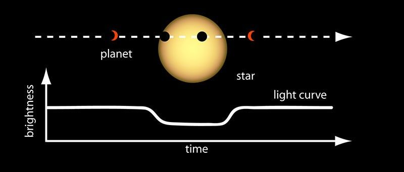

## Exoplanet-Classifier
Classifying Kepler objects of interest by number of orbiting exoplanets using gradient boosting.
---

### How We Detect Exoplanets

*A planet passing in front of its parent star creates a dip in brightness - a transit. Depth indicates planet size; spacing indicates orbital period.*

Credit: NASA Ames · [Source](https://science.nasa.gov/solar-system/skywatching/night-sky-network/may2025-night-sky-notes/)

https://github.com/user-attachments/assets/563a1316-dfad-43f2-a4fc-0a7e92f90436

*Animated planet transit.*
