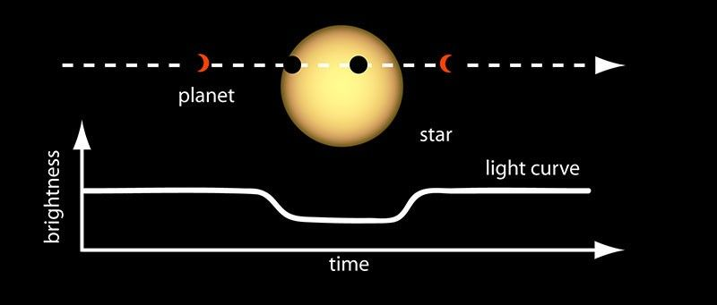
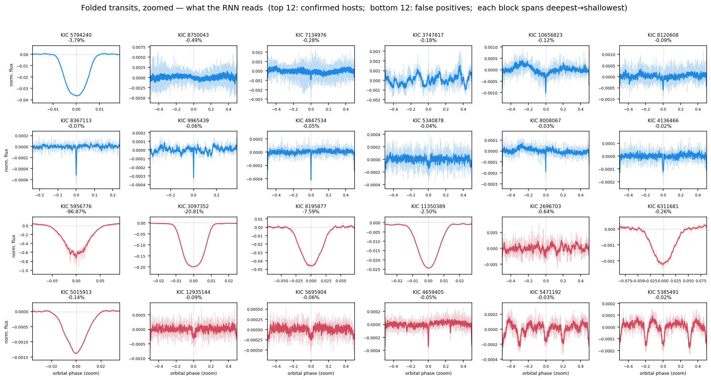
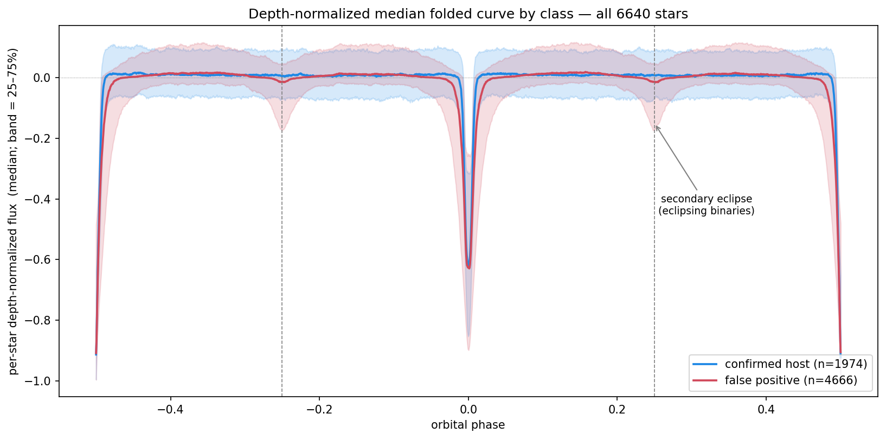
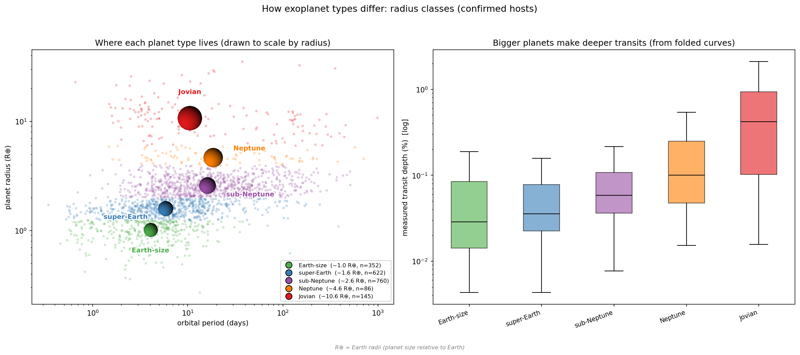
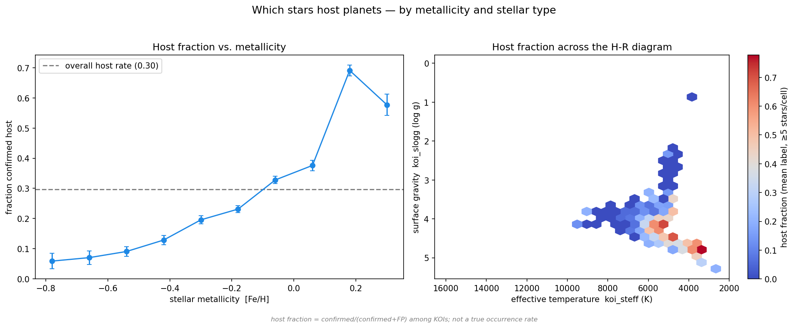

## Exoplanet-Classifier
Classifying Kepler objects of interest by number of orbiting exoplanets using gradient boosting.

### How We Detect Exoplanets

*A planet passing in front of its parent star creates a dip in brightness - a transit. Depth indicates planet size; spacing indicates orbital period.*

https://github.com/user-attachments/assets/563a1316-dfad-43f2-a4fc-0a7e92f90436

*Animated planet transit.*

Credit: NASA Ames · [Source](https://science.nasa.gov/solar-system/skywatching/night-sky-network/may2025-night-sky-notes/)

### The Data

We label each Kepler star from the KOI catalog: `1` if any of its objects of interest is **CONFIRMED** (hosts an exoplanet), `0` if all are **FALSE POSITIVE** (no exoplanet). CANDIDATE dispositions are excluded since they are unverified and would add label noise.

**What does the raw signal look like for a host vs. a false positive?**

*Folded light curves, zoomed on the transit window. Top 12 are confirmed host examples: clean and repeating brightness dips as the planet crosses its star. Bottom 12 are false positive examples: mostly noise with no coherent transit. This is the signal our models learn to separate.*

**What separates a real planet from a false positive?**

*Median folded curve across all 6,640 stars, each scaled to its own transit depth. Both classes share the primary dip at phase 0 (and the wrapped edges at ±0.5). Only false positives (red) add the shallow dips at phase ±0.25. These are eclipsing-binary secondary eclipses, and the classifier keys on them.*

**How do different types of planets differ in the signal they leave?**

*Confirmed planets span Earth-size up to gas giants, most at short orbital periods where they transit often and are easiest to catch (left panel). Planet size largely drives the signal: median transit depth climbs steadily from Earth-size to Jovian (right panel), since bigger planets block more starlight and leave deeper, easier-to-detect dips. It is only a trend though, because depth is roughly the ratio of the planet's area to its star's, so the same planet looks deeper around a smaller star. Because of this, the size classes overlap: an Earth-size planet around a small star can leave the same depth as a super-Earth around a bigger one. The smallest planets are also the hardest to measure, since their tiny dips get lost in the light curve's noise.*

**Which stars are more likely to host planets?**

*Metal-rich stars host confirmed planets far more often (host fraction climbs from ~0.06 to ~0.7 with metallicity), and cooler stars host more than hot ones across the H-R diagram. Surface gravity matters too: confirmed planets show up mostly around compact, high-gravity main-sequence dwarfs rather than puffed-up low-gravity giants, partly because a smaller star makes the same planet's transit deeper and easier to detect.*

